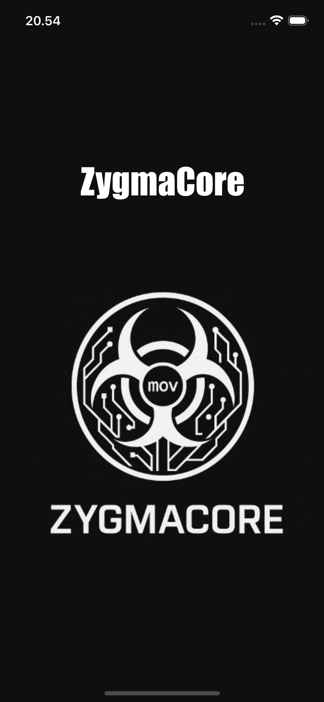

<h1 align="center">ZygmaCore App</h1>

<p align="center">
  
  
  
  
</p>

<p align="center">
  
</p>

<h3 align="center">
  A minimal iOS application showcasing the ZygmaCore brand with a clean, centered layout using Storyboard.
</h3>

---

## 📘 About The Project

**ZygmaCore App** is a simple, minimalistic iOS application built using **UIKit + Storyboard**.  
The app displays a clean fullscreen layout featuring:

- The **ZygmaCore title**  
- The official **ZygmaCore emblem**  
- A pure black background for a modern, high-contrast aesthetic  

This app serves as a foundation for branding screens, onboarding flows, or future expansion into full ZygmaCore mobile utilities.

---

## 🖼 App Preview



---

## 🛠 Tech Stack

| Technology | Usage |
|-----------|--------|
| 🍎 **iOS / UIKit** | Building the interface |
| 🎨 **Storyboard** | Layout and UI composition |
| 🖼 **Image Assets** | ZygmaCore branding logo |
| 📝 **Swift** (optional) | Logic for future features |

---

## ✨ Features

- 🖤 **Minimalist black UI** for high contrast  
- 🧭 **Centered layout** using Auto Layout in Storyboard  
- 📛 **Brand title + logo** placed with consistent spacing  
- 📱 Works on all iPhone screen sizes  
- 🚀 Lightweight and fast load  

---

## 🚀 Getting Started

### 1️⃣ Clone the repository

```bash
git clone https://github.com/ZygmaCore/zygmacore_app.git
cd zymacore_app
```

### 2️⃣ Open project in Xcode

```
open zygmacore.xcodeproj
```

### 3️⃣ Run on Simulator or Physical Device

```bash
⌘ + R
```

---

## 🤝 Contributing

Have ideas to expand the ZygmaCore app?  
Feel free to contribute!

1. Fork the repo  
2. Create feature branch  
3. Commit & push  
4. Open a pull request  

---

## 📄 License & Contact

Licensed under **MIT License**.  
See `LICENSE` for details.

**Author Contact:**  
🌐 https://alhikam.me  
🐙 https://github.com/ZygmaCore
